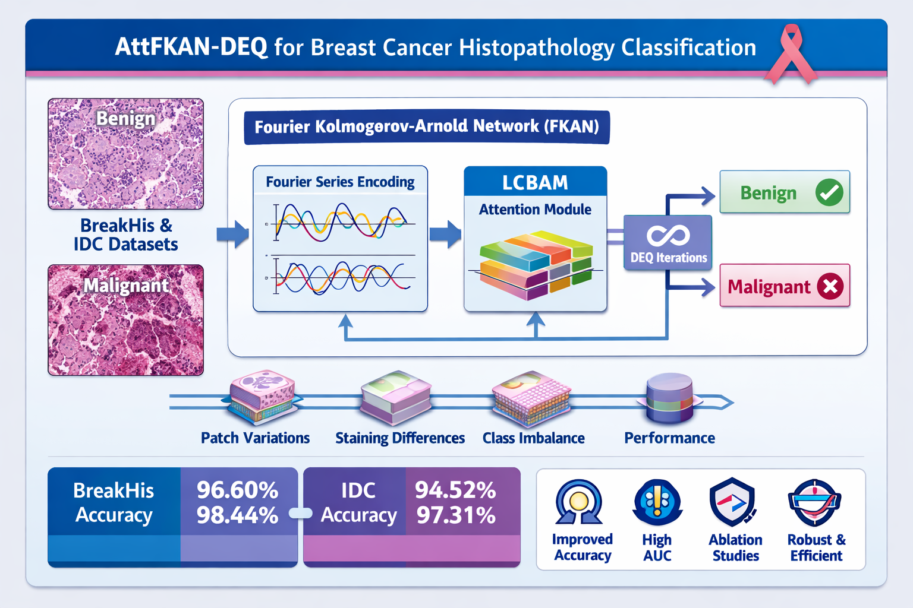

# AttFKAN-DEQ

**Attention-Enhanced Fourier Kolmogorov–Arnold Networks Using Deep Equilibrium for Breast Cancer Histopathology Classification**

> Hassan Ali · Muhammad Asghar Khan · Gordana Barb  
> *IEEE Access* (under review)

---
## Architecture Diagram


## Overview

AttFKAN-DEQ is a hybrid deep-learning framework for binary benign-vs-malignant classification of breast histopathological images. It fuses three complementary ideas into a single, memory-efficient pipeline:

| Component | Role |
|-----------|------|
| **Fourier KAN (FKAN)** | Replaces fixed activations with per-edge learnable Fourier series, capturing multi-scale frequency patterns in tissue textures |
| **Lightweight CBAM (LCBAM)** | Dynamically recalibrates channel and spatial features during DEQ iterations using depthwise convolutions (≈98 params for spatial attention) |
| **Deep Equilibrium (DEQ)** | Solves for a fixed-point hidden state *z\** instead of stacking layers — infinite effective depth with constant memory |

The full pipeline is:

```
Image x
  └─ CNN Backbone ──► Global Avg Pool ──► Linear ──► p  [B, h]
                                                       │
                          ┌────────────────────────────┘
                          ▼
                     z⁽⁰⁾ = 0
                     ┌────────────────────────────────────────────┐
                     │  z⁽ᵏ⁺¹⁾ = (1−α)z⁽ᵏ⁾ + α·(p + f_AttFKAN(z⁽ᵏ⁾+p)) │  × max_iters
                     └────────────────────────────────────────────┘
                          │
                          ▼  z*  (equilibrium state)
                     Linear Classifier ──► logits  [B, 2]
```

where `f_AttFKAN(u) = u + LCBAM(FKAN₂(ReLU(FKAN₁(LN(u)))))`.

---

## Results

### BreakHis Dataset (all magnifications, 5-fold CV)

| Model | Accuracy | Precision | Recall | Specificity | F1-Score | AUC |
|-------|----------|-----------|--------|-------------|----------|-----|
| ResNet-18 | 89.45 | 88.72 | 87.91 | 90.14 | 88.31 | 93.56 |
| ResNet-50 | 91.73 | 90.88 | 90.42 | 92.61 | 90.65 | 95.18 |
| ResNet-152 | 93.67 | 93.02 | 92.58 | 94.43 | 92.80 | 96.51 |
| EfficientNet-B0 | 93.19 | 92.48 | 92.67 | 94.02 | 92.57 | 96.13 |
| Swin Transformer | 94.36 | 93.71 | 93.95 | 94.88 | 93.83 | 96.75 |
| ConvNeXt | 95.12 | 94.57 | 94.82 | 95.41 | 94.69 | 97.28 |
| DEQ-KAN | 93.66 | — | — | — | — | — |
| **AttFKAN-DEQ (ours)** | **96.60** | **96.12** | **96.28** | **96.85** | **96.20** | **98.44** |

### IDC Dataset (50×50 patches, 5-fold CV)

| Model | Accuracy | Precision | Recall | Specificity | F1-Score | AUC |
|-------|----------|-----------|--------|-------------|----------|-----|
| ResNet-152 | 92.71 | 92.14 | 91.78 | 93.52 | 91.96 | 95.67 |
| ConvNeXt | 94.12 | 93.68 | 93.51 | 94.62 | 93.59 | 96.89 |
| **AttFKAN-DEQ (ours)** | **94.52** | **94.18** | **94.37** | **94.68** | **94.27** | **97.31** |

### Model Efficiency (NVIDIA V100, 224×224, batch=1)

| Model | Parameters | GFLOPs | Inference |
|-------|-----------|--------|-----------|
| ViT-B/16 | 86.0 M | 17.60 | 45.3 ms |
| ResNet-50 | 25.6 M | 4.10 | 12.4 ms |
| EfficientNet-B0 | 5.3 M | 0.39 | 4.8 ms |
| DEQ-KAN | 5.0 M | 0.50 | 7.1 ms |
| **AttFKAN-DEQ** | **6.0 M** | **0.60** | **8.3 ms** |

---

## Repository Structure

```
AttFKAN-DEQ/
├── attfkan_deq.py      # Full model: CNN backbone + AttFKAN block + DEQ loop
├── fourier_kan.py      # NaiveFourierKANLayer — per-edge Fourier series activations
├── lcbam.py            # Lightweight Convolutional Block Attention Module
├── train.py            # 5-fold cross-validation training script
├── requirements.txt
└── README.md
```

---

## Installation

```bash
git clone https://github.com/Hassan48khan/AttFKAN-DEQ.git
cd AttFKAN-DEQ
pip install -r requirements.txt
```

Requires Python ≥ 3.9 and PyTorch ≥ 2.0.

---

## Datasets

### BreakHis

Download from [Kaggle](https://www.kaggle.com/datasets/ambarish/breakhis) or the [official page](https://web.inf.ufpr.br/vri/databases/breast-cancer-histopathological-database-breakhis/).

Expected folder structure (binary split):
```
BreaKHis/
├── benign/
│   └── *.png
└── malignant/
    └── *.png
```

The dataset contains 7,909 RGB images from 82 patients at 40×, 100×, 200×, and 400× magnification (2,480 benign / 5,429 malignant).

### IDC (Invasive Ductal Carcinoma)

Download from [Kaggle](https://www.kaggle.com/datasets/paultimothymooney/breast-histopathology-images).

Expected folder structure:
```
IDC/
├── 0/   # negative (non-cancerous) — 198,738 patches
└── 1/   # positive (cancerous)     —  78,786 patches
```

50×50 pixel RGB patches at 40× magnification, from 162 whole-slide images.

---

## Training

```bash
# BreakHis — custom backbone
python train.py \
  --dataset breakhis \
  --data_dir /path/to/BreaKHis \
  --backbone custom \
  --hidden_dim 128 \
  --grid_size 8 \
  --max_iters 10 \
  --alpha 0.5 \
  --epochs 50 \
  --batch_size 32 \
  --lr 1e-3

# IDC — custom backbone
python train.py \
  --dataset idc \
  --data_dir /path/to/IDC \
  --backbone custom \
  --epochs 50 \
  --batch_size 32

# BreakHis — ResNet-50 backbone
python train.py \
  --dataset breakhis \
  --data_dir /path/to/BreaKHis \
  --backbone resnet50 \
  --hidden_dim 512
```

All metrics (accuracy, precision, recall, specificity, F1, AUC) are reported as mean ± std over 5 folds.

---

## Hyperparameters

| Parameter | Default | Range Explored | Notes |
|-----------|---------|---------------|-------|
| Batch size | 32 | 16 – 64 | GPU memory / gradient balance |
| Learning rate | 1×10⁻³ | 10⁻⁴ – 5×10⁻³ | Higher values unstable |
| Max DEQ iters | 10 | 5 – 20 | Best performance/compute trade-off |
| Relaxation α | 0.5 | 0.1 – 1.0 | Best speed-stability balance |
| Fourier grid g | 8 | 4 – 16 | Expressivity vs. overfitting |
| LCBAM reduction r | 16 | 8 – 32 | Lightweight attention |
| Max epochs | 50 | — | Early stop: patience = 10 |
| Weight decay | 1×10⁻⁵ | — | Mild regularisation |

---

## Architecture Details

### Fourier KAN Layer

Each edge (iᵢₙ, jₒᵤₜ) learns its own univariate function:

```
φⱼᵢ(z) = bⱼᵢ + Σₖ₌₁ᵍ [ aⱼᵢₖ·cos(kz) + bⱼᵢₖ·sin(kz) ]
```

The full layer output is `[f_FKAN(z)]ⱼ = Σᵢ φⱼᵢ(zᵢ)`. Sine/cosine bases form an orthogonal set capable of approximating any smooth function, making them well-suited for periodic textures in histopathological patches.

### LCBAM

Sequential channel → spatial attention:

```
Channel:  d_avg = AvgPool(M) → Conv1×1(C→C/r) → BN → ReLU → Conv1×1(C/r→C) → Sigmoid
Spatial:  concat(avg_c, max_c) → DWConv 7×7 → Conv1×1 → BN → Sigmoid
```

Parameter count: `~2C²/r` (channel) + `~98` (spatial) — vs CBAM's `~2C²` (channel) + `49×C` (spatial).

### DEQ Fixed-Point Iteration

Starting from z⁽⁰⁾ = 0, iterate until convergence:

```
z⁽ᵏ⁺¹⁾ = (1−α)·z⁽ᵏ⁾ + α·(p + f_AttFKAN(z⁽ᵏ⁾ + p))
```

Stop when `‖z⁽ᵏ⁺¹⁾ − z⁽ᵏ⁾‖ < tol·(‖z⁽ᵏ⁾‖ + ε)` or `k = max_iters`. Convergence is guaranteed when the AttFKAN block is contractive (Lipschitz constant L < 1), which is enforced via coefficient regularisation and spectral normalisation.

---

## Quick Start (Python API)

```python
import torch
from attfkan_deq import AttFKAN_DEQ

model = AttFKAN_DEQ(
    in_channels=3,
    hidden_dim=128,
    num_classes=2,
    grid_size=8,
    max_iters=10,
    alpha=0.5,
    backbone="custom",   # or "resnet18" / "resnet50"
)

x = torch.randn(4, 3, 50, 50)   # IDC patch size
logits = model(x)                # [4, 2]
print(f"Parameters: {model.count_parameters():,}")
```

---

## Ablation Study (BreakHis)

| Variant | Accuracy | F1 | AUC |
|---------|----------|----|-----|
| CNN only | 90.34 | 89.39 | 94.18 |
| CNN + MLP (no DEQ) | 92.18 | 91.24 | 95.37 |
| CNN + MLP + DEQ | 93.72 | 92.98 | 96.61 |
| CNN + FKAN (no attention, no DEQ) | 94.89 | 94.24 | 97.02 |
| CNN + FKAN + DEQ (no attention) | 95.67 | 95.21 | 97.68 |
| **AttFKAN-DEQ (full)** | **96.60** | **96.20** | **98.44** |

---

## Citation

If you use this code or build upon our work, please cite:

```bibtex
@article{ali2025attfkandeq,
  title   = {{AttFKAN-DEQ}: Attention-Enhanced Fourier Kolmogorov--Arnold Networks
             Using Deep Equilibrium for Breast Cancer Histopathology Classification},
  author  = {Ali, Hassan and Khan, Muhammad Asghar and Barb, Gordana},
  journal = {IEEE Access},
  year    = {2025},
  note    = {Under review}
}
```

---

## Acknowledgements

- DEQ framework: [Bai et al., NeurIPS 2019](https://arxiv.org/abs/1909.01377)
- KAN: [Liu et al., arXiv:2404.19756](https://arxiv.org/abs/2404.19756)
- FourierKAN: [Xu et al., arXiv:2406.01034](https://arxiv.org/abs/2406.01034)
- CBAM: [Woo et al., ECCV 2018](https://arxiv.org/abs/1807.06521)
- BreakHis dataset: [Spanhol et al., IEEE TBME 2015](https://doi.org/10.1109/TBME.2015.2496264)
- IDC dataset: [Cruz-Roa et al., SPIE 2014](https://doi.org/10.1117/12.2043872)

---

## License

This project is released under the MIT License.
